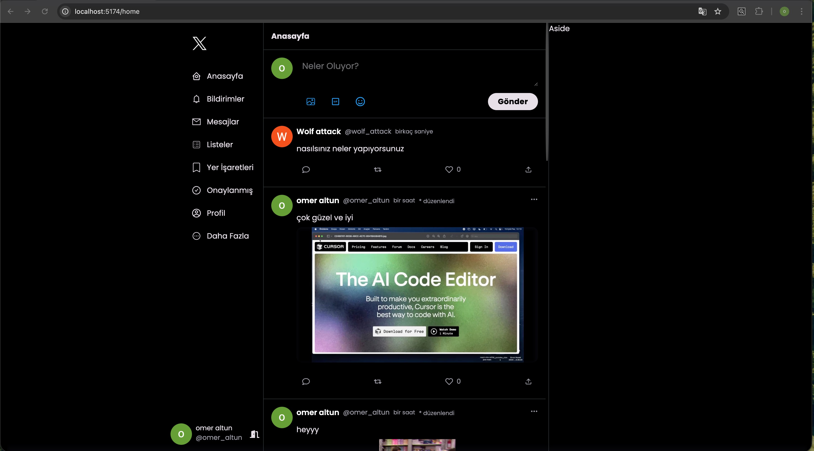

# Twitter (X) Clone - React & Firebase

A modern, full-stack Twitter (X) clone featuring real-time data streaming and advanced media management. Users can securely authenticate and share, edit, or delete posts with various media types (image, video, audio).

## Key Technical Features

Real-time Synchronization: Instant feed updates using Firestore "Snapshot" listeners.

Advanced Media Handling: Asynchronous uploads to Firebase Storage with UUID naming and strict MIME type/size validations.

Secure Authentication: Integrated Google OAuth and traditional Email/Password flows.

HOC & Protected Routes: Higher-Order Component architecture to secure private routes based on auth status.

Modern UI: Built with Tailwind CSS v4, featuring a responsive grid system and dark-mode optimization.

## 🛠️ Tech Stack

Frontend: React 19, Vite, React Router 7

Backend: Firebase (Auth, Firestore, Storage)

Styling: Tailwind CSS v4, React Icons

State & Utils: React Hooks, Day.js, UUID, React Toastify

## ⚙️ Technical Details

Storage Logic: The app ensures data integrity by purging associated media from Firebase Storage whenever a post is deleted. It uses decodeURIComponent for safe path extraction.

Form Management: Utilizes URL.createObjectURL for instant media previews and manages async states with an isLoading tracker for a smooth UX.

Auth Guard: The Protected component monitors onAuthStateChanged and enforces emailVerified status before allowing access to the home feed.

# Twitter (X) Clone - React & Firebase

Modern web teknolojileri kullanılarak geliştirilmiş, gerçek zamanlı veri akışı ve gelişmiş medya yönetimi özelliklerine sahip bir Twitter (X) Clone uygulamasıdır. Kullanıcılar güvenli şekilde giriş yapabilir; resim, video veya ses içeren gönderiler paylaşıp düzenleyebilir.

## 🚀 Öne Çıkan Teknik Özellikler

Gerçek Zamanlı Senkronizasyon: Firestore "Snapshot" dinleyicileri ile tweetlerin anlık takibi.

Gelişmiş Medya İşleme: Firebase Storage entegrasyonu, UUID ile isimlendirme ve katı tip/boyut validasyonları.

Güvenli Kimlik Doğrulama: Google OAuth ve geleneksel E-posta/Şifre giriş sistemleri.

HOC & Korumalı Rotalar: Oturum durumuna göre rotaları güvence altına alan Yüksek Mertebeli Bileşen (HOC) yapısı.

Modern Arayüz: Tailwind CSS v4 ile geliştirilmiş responsive grid sistem ve karanlık mod odaklı tasarım.

## 🛠️ Kullanılan Teknolojiler

Frontend: React 19, Vite, React Router 7

Backend: Firebase (Auth, Firestore, Storage)

Styling: Tailwind CSS v4, React Icons

Yardımcı Araçlar: React Hooks, Day.js, UUID, React Toastify

## ⚙️ Teknik Detaylar

Depolama Mantığı: Bir gönderi silindiğinde, bağlı medya dosyası da Firebase Storage üzerinden temizlenir. Güvenli dosya yolu erişimi için decodeURIComponent kullanılır.

Form Yönetimi: URL.createObjectURL ile anlık medya önizlemesi sağlanır ve asenkron süreçler isLoading takibi ile yönetilir.

Erişim Kontrolü: Protected bileşeni onAuthStateChanged metodunu dinler ve anasayfa erişimi için emailVerified (eposta doğrulaması) şartı koşar.

## 📦 Kurulum

Klonla: git clone [repo-url]

Yükle: npm install

Değişkenler: .env dosyası oluşturun ve VITE_API_KEY=anahtariniz ekleyin.

Çalıştır: npm run dev

## Ekran Görüntüsü

## Gifs

